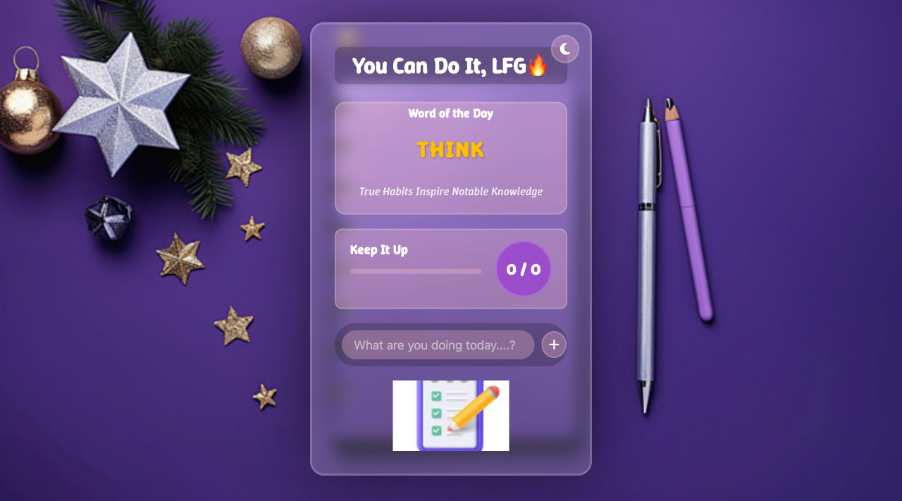

# JustDoIt - Motivational Todo App



A beautiful, responsive Todo List application with a modern glass-morphism design. Keep track of your tasks, visualize your progress, and enjoy a satisfying confetti celebration when you complete everything on your list!

## 🌟 Features

- **Clean, Modern UI**: Aesthetic glass-morphic design with subtle animations
- **Dark/Light Theme**: Toggle between color schemes based on preference
- **Task Categories**: Organize tasks by personal, work, and urgent categories
- **Category Filtering**: Focus on specific types of tasks with one-click filters
- **Task Management**: Add, edit, and delete tasks easily
- **Progress Tracking**: Visual progress bar and completion counter
- **Data Persistence**: Local storage saves your tasks between sessions
- **Responsive Design**: Works seamlessly on mobile, tablet, and desktop
- **Task Completion**: Check off tasks and see your progress update in real-time
- **Celebration Animation**: Confetti burst when all tasks are completed
- **Empty State Handling**: Friendly visual feedback when task list is empty
- **Animated Words of Motivation**: Dynamic typing effect showcasing motivational acronyms

## 🚀 Live Demo

Check out the live demo: [JustDoIt Todo App](https://lukedoit.vercel.app)

## 🖥️ Technologies Used

- HTML5
- CSS3 (with modern features like Flexbox and CSS Variables)
- Vanilla JavaScript
- [Typed.js](https://github.com/mattboldt/typed.js/) for typing animations
- [AOS](https://michalsnik.github.io/aos/) for scroll animations
- [tsParticles Confetti](https://github.com/tsparticles/tsparticles) for celebration animation
- FontAwesome for icons

## 📱 Responsive Design

This application is fully responsive and works on:
- Mobile phones (portrait and landscape)
- Tablets
- Desktops and laptops

## 🛠️ Installation & Setup

1. Clone this repository:
```bash
git clone https://github.com/yourusername/JustDoIt.git
```

2. Navigate to the project directory:
```bash
cd JustDoIt
```

3. Open `index.html` in your browser or use a live server:
```bash
# If you have python installed
python -m http.server

# If you have Node.js and npx installed
npx serve
```

## 🧰 Project Structure

```
JustDoIt/
├── index.html          # Main HTML file
├── style.css           # Styles for the application
├── script.js           # JavaScript functionality
├── images/             # Directory containing images
│   ├── background.jpg          # Light theme background image
│   ├── background-dark.jpg     # Dark theme background image
│   └── emptyimage.jpg          # Image shown when task list is empty
├── screenshots/        # Screenshots for documentation
└── README.md           # This file
```

## 🔧 How to Use

1. **Add a Task**: Type your task in the input field, select a category icon, and press Enter or click the "+" button
2. **Edit a Task**: Click the pencil icon on any incomplete task to edit it
3. **Delete a Task**: Click the trash icon to remove a task
4. **Complete a Task**: Check the checkbox to mark a task as complete
5. **Select Category**: Click on a category icon (Personal, Work, Urgent) when adding a task
6. **Filter Tasks**: Click on category buttons (All, Work, Personal, Urgent) to filter tasks
6. **Track Progress**: Watch your progress bar and counter update in real-time
7. **Switch Theme**: Click the sun/moon icon in the top-right to toggle between light and dark modes
8. **Celebration**: Complete all tasks to see a confetti celebration!

## Task Categories Feature

### Overview

The app now includes task categorization and filtering, enabling users to organize their tasks by type and focus on specific categories.

### Key Features

- **Simple Categories**: Three default categories - Personal, Work, and Urgent
- **Visual Category Tags**: Colored tags make it easy to identify task types at a glance
- **Icon-Based Category Selection**: Intuitive icon buttons for selecting task categories
- **Color-Coded Tasks**: Tasks are visually styled based on their category
- **Category Filters**: One-click filtering to focus on specific task types
- **Category Persistence**: Category data is saved between sessions

### Implementation Details

The task categorization implementation uses:
- Data attributes to store category information
- localStorage for persistence
- Visual category tags with category-specific colors
- Color-coded backgrounds for tasks based on their category
- Icon-based category selection buttons
- Simple filtering mechanism that preserves task order

### User Experience

Users can:
- Assign categories when creating tasks with intuitive icon buttons
- Visualize task types with color-coded tags and backgrounds
- Filter the task list to focus on specific categories
- Edit tasks to change their categories
- Have categories persist across browser sessions
- Quickly identify task types through consistent color schemes

## Dark/Light Theme Toggle Feature

### Overview

The app features a dynamic dark/light theme toggle, allowing users to switch between color schemes based on their preference. This theme choice persists across sessions using local storage.

### Key Features

- **Intuitive Toggle**: A moon/sun icon button in the top right corner of the app
- **Persistent Preferences**: User theme selection is saved between sessions
- **Smooth Transitions**: Subtle animations when switching between themes
- **Complete Styling**: All UI elements properly styled in both themes
- **Accessibility**: Proper contrast and readability in both modes

### Implementation Details

The theme toggle implementation uses:
- CSS variables for consistent theming
- localStorage for persistence
- Dynamically created theme toggle button
- Attribute-based theme switching

### How It Works

1. **Theme Variables**: CSS variables define colors for both themes
   ```css
   :root {
     /* Light theme variables */
     --bg-image: url(images/background.jpg);
     --text-color: white;
     /* ...more variables */
   }

   [data-theme="dark"] {
     /* Dark theme variables */
     --bg-image: url(images/background-dark.jpg);
     --text-color: #e0e0e0;
     /* ...more variables */
   }
   ```

2. **Toggle Button Logic**: JavaScript creates and manages the toggle button
   ```javascript
   // Toggle theme when button is clicked
   themeToggleBtn.addEventListener('click', () => {
     // Get current theme
     const currentTheme = document.documentElement.getAttribute('data-theme') || 'light';
     
     // Toggle to other theme
     const newTheme = currentTheme === 'light' ? 'dark' : 'light';
     
     // Update data-theme attribute
     document.documentElement.setAttribute('data-theme', newTheme);
     
     // Save preference to local storage
     localStorage.setItem('theme', newTheme);
     
     // Update button icon
     updateThemeIcon(newTheme);
   });
   ```

3. **Persistence**: Theme preference is stored in localStorage and applied on page load
   ```javascript
   // Check for saved theme preference or use default
   const currentTheme = localStorage.getItem('theme') || 'light';
   
   // Apply the saved theme on page load
   document.documentElement.setAttribute('data-theme', currentTheme);
   ```

### User Experience

Users can:
- Click the sun/moon icon to toggle between light and dark themes
- Have their theme preference automatically applied on return visits
- Experience a visually consistent interface regardless of theme choice

### Future Enhancements

Possible future improvements:
- System preference detection (prefers-color-scheme)
- Additional theme options beyond light/dark
- Theme scheduling (auto-switch between light/dark based on time of day)

## 💾 Local Storage

The app uses browser local storage to save your tasks, categories, and theme preferences. This means:
- Your tasks and their categories persist even if you close the browser
- Your theme preference is remembered between sessions
- Data is stored only on your device (not on any server)
- Clearing browser data will remove saved tasks and preferences

## 📝 Roadmap

Planned features for future releases:

- [ ] User authentication (sign up/login) system
- [ ] Cloud storage for task persistence across devices
- [ ] Previous day tasks history and analytics
- [ ] Hourly email reminders for important tasks
- [x] Task categories and filtering
- [ ] Due dates and reminders
- [ ] Drag and drop task reordering
- [ ] Export/Import task lists
- [ ] Task sharing capabilities
- [ ] More animation options
- [ ] Customizable backgrounds
- [ ] Full PWA implementation

## 🤝 Contributing

Contributions are welcome! Please feel free to submit a Pull Request.

1. Fork the project
2. Create your feature branch (`git checkout -b feature/AmazingFeature`)
3. Commit your changes (`git commit -m 'Add some AmazingFeature'`)
4. Push to the branch (`git push origin feature/AmazingFeature`)
5. Open a Pull Request

## 📝 License

This project is licensed under the MIT License - see the LICENSE.md file for details.

## 🙏 Acknowledgements

- Font Awesome for the icons
- Google Fonts for the Winky Rough font
- Typed.js for the typing animation effect
- AOS library for scroll animations
- tsParticles for the confetti effect
- Inspiration from glass-morphism design trends

---

Made with ❤️ by LUKE

*Theme toggle feature added on April 19, 2025*
*Task Categories feature added on April 26, 2025*


If you found this project helpful or used it as a base for your own work, consider giving it a ⭐!
